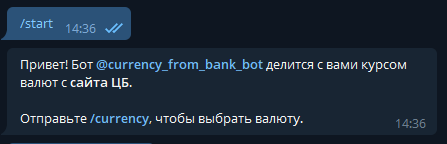

# CurrencyRateTgBot
Телеграм бот для отправки пользователю курса валют с сайта ЦБ.

(с 6 марта)

## Инструкция по использованию:
1. Проверьте, что у вас установлен Python 3.10+.
2. Форкните репозиторий, а затем склонируйте. 
3. Для работы с ботом необходимо установить пакеты с помощью: 
<code>pip install -r requirements.txt</code> 
Либо установите пакеты: pyTelegramBotAPI, requests, bs4, lxml с помощью команды: 
<code>pip install _package_name_</code>
4. Создайте файл settings.py, в котором будет информация о вашем боте. Пример файла settings.py: 
<code>BOT_TOKEN = 'token'</code> 
<code>BOT_NAME = '@bot_name'</code> 
\* инструкция по созданию тг бота и получению токена по ссылке: https://clck.ru/dWnJq
5. Запустите файл bot.py.

## Список команд:
- **/start** - начать общение с ботом

- **/currency** - открывается inline-клавиатура с выбором предпочитаемой валюты

- сообщение от бота после нажатия inline-кнопки:
